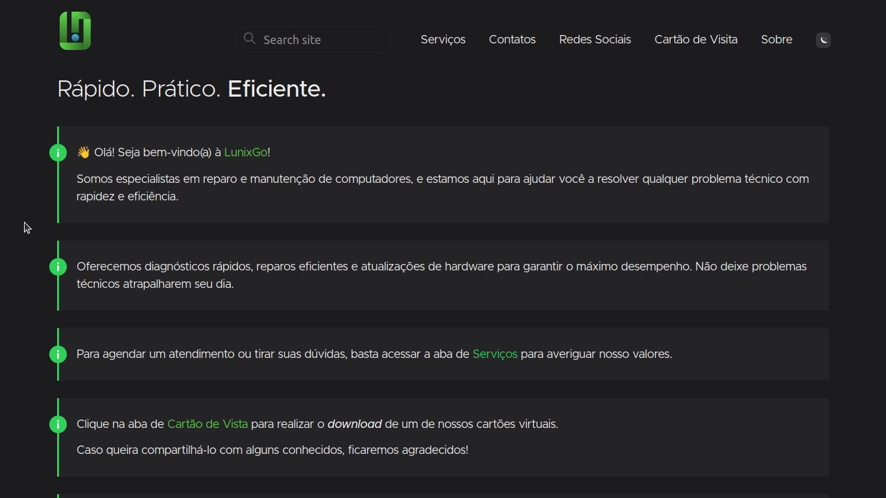

# Lunix Go | Suporte Técnico

O projeto a seguir refere-se a uma solução de desenvolvimento voltada para um negócio de reparo de equipamento eletrônicos. Trata-se, portanto, de um site por meio do qual é possível ter acessos aos serviços, ao preço e ao responsável pela empresa.

Para sua construção, foi realizado as seguinte ferramentas:

- [Hugo Framework](https://gohugo.io/)

- [Compose Theme](https://themes.gohugo.io/themes/compose/)

- [Netlify](https://www.netlify.com/)



### Seções

1. Serviços

```
Será disponibilizado uma tabela com os respectivos valores referentes aos serviços oferecidos. São estes:

    1.1. Suporte para computadores;
    1.2. Suporte para celulares;
    1.3. Suporte para impressora; 
    1.4. Suporte para rede;
    1.5. Medidas de segurança;
    1.6. Desenvolvimento.
```

2. Contatos

```
Estará disponível o contato da equipe técnica responsável pela solicitação.
```

3. Redes Sociais

4. Cartão de Visita

5. Sobre

## ExampleSite

The [exampleSite](https://github.com/onweru/compose/tree/master/exampleSite) serves as this theme's [user guide](https://composedocs.netlify.app/docs/compose/install-theme/) .

This guide covers the necessary bits. As the project evolves, the user-guide will get more comprehensive

You can use Hugo to generate and serve a local copy of the guide (also useful for testing local theme changes).

```
git clone --recurse-submodules --depth 1 https://github.com/onweru/compose.git
cd compose/exampleSite/
hugo server --themesDir ../..
```

## License

This theme is available under the [MIT license](https://github.com/onweru/compose/blob/master/LICENSE).
